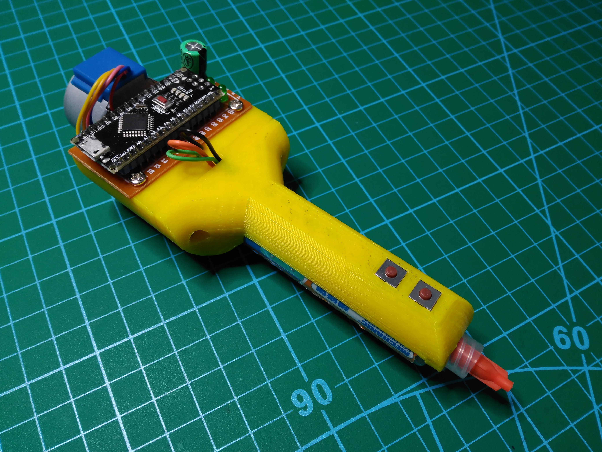

# Solder paste dispenser

This project is based on the Geir Andersen's solder paste dispenser. His documentation can be found here:
- [Project forum](https://www.robotshop.com/community/forum/t/solder-paste-dispenser/31738)
- [3D parts](https://www.thingiverse.com/thing:384680) 

The electronic and programming parts are based on [this tutorial](https://42bots.com/tutorials/28byj-48-stepper-motor-with-uln2003-driver-and-arduino-uno/).

The version of my dispenser is very similar, but requires mounting an electronic prototipe and can be supplied by USB.

Here are the components of the project:
- 3D parts, who's files can be founded in this repository
- Solder paste syringe
- Syringe needle
- 28BYJ-48 5V stepper motor
- 5 to 5mm aluminum shaft coupler
- Threaded rod M5x60mm
- 2x carbon fiber rod 45x3mm
- Nut M5
- 2x M3x12mm screw
- 4x M3x6mm screw
- 6x M3 nut insert with 4mm external diameter
- Prototyping PCB
- Arduino with USB connector
- ULN2003 driver
- 2x pushbutton
- 2x led
- 2x 220 ohmios resistor
- Big capacitor for supply filtering
- Some wires

Please, pay attention when mounting the electronic prototype. The ULN2003 schema is the same than the mentioned tutorial, but used different pins of Arduino. That's the pin distribution:
- D2: led 2
- D3: led 1
- D4: forward pushbutton
- D5: backward pushbutton
- D6: ULN2003 to blue wire of motor
- D7: ULN2003 to pink wire of motor
- D8: ULN2003 to orange wire of motor
- D9: ULN2003 to yellow wire of motor

Function modes:
- One specific pushbutton (the front one) for pushing the paste
- Another button (the rear one) for change forward speed (short pulse; 4 different forward speeds, signaled with two leds on binary) and retract the piston (long pulse)

## Autor

[Rubén Espino San José](https://github.com/Resaj)

## Licencia

Todos estos productos están liberados mediante [Creative Commons Attribution-ShareAlike 4.0 International License](http://creativecommons.org/licenses/by-sa/4.0/).  

_All these products are released under [Creative Commons Attribution-ShareAlike 4.0 International License](http://creativecommons.org/licenses/by-sa/4.0/)._
